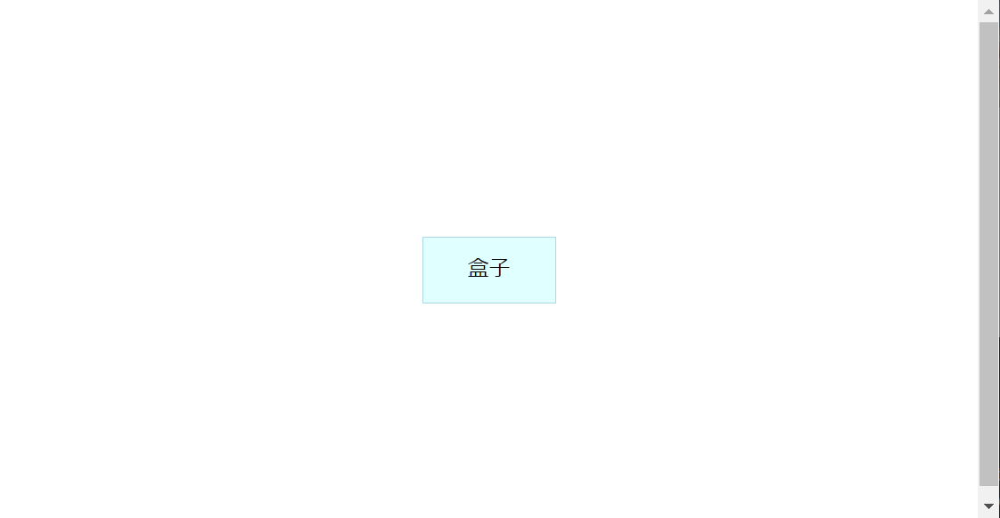

***

***

<a name="e10e7927"></a>

# 水平垂直居中

> 已知在如下页面中有一个盒子, 对其进行水平垂直居中:

```html
<style>
  html,
  body {
    height: 100%;
  }
  .box {
    box-sizing: border-box;
    width: 100px;
    height: 50px;
    line-height: 48px;
    text-align: center;
    font-size: 16px;
    border: 1px solid lightblue;
    background: lightcyan;
  }
</style>

<body>
  <div class="box">盒子</div>
</body>
```

<a name="ff40a9ca"></a>

## 绝对定位

<a name="1b4f90d4"></a>

### margin-top && margin-top 50%width\&height

```html
<style>
  html,
  body {
    height: 100%;
  }
  .box {
    box-sizing: border-box;
    width: 100px;
    height: 50px;
    line-height: 48px;
    text-align: center;
    font-size: 16px;
    border: 1px solid lightblue;
    background: lightcyan;
  }
</style>
<style>
  body {
    position: relative;
  }
  .box {
    position: absolute;
    top: 50%;
    left: 50%;
    margin-top: -25px;
    margin-left: -50px;
  }
</style>
<body>
  <div class="box">盒子</div>
</body>
```

最终效果:



这种方案的缺点很明显: 必须知道当前盒子具体的宽高值,然后算出一半是多少,再进行居中操作.

<a name="43d88eb9"></a>

### top,left,right,bottom,margin:auto

下面这种延伸方案, 对于 box 根据自身的宽高来进行计算了

```html
<style>
  html,
  body {
    height: 100%;
  }
  .box {
    box-sizing: border-box;
    width: 100px;
    height: 50px;
    line-height: 48px;
    text-align: center;
    font-size: 16px;
    border: 1px solid lightblue;
    background: lightcyan;
  }
</style>

<style>
  body {
    position: relative;
  }

  .box {
    position: absolute;
    top: 0;
    left: 0;
    right: 0;
    bottom: 0;
    margin: auto;
  }
</style>
<body>
  <div class="box">盒子</div>
</body>
```

这种方案仍然可以进行水平垂直居中.


缺点: 虽然对于这种方案来说, 看似不需要知道盒子宽高了, 但是这个宽高必须设置, 如果我们没有设置宽高想要靠内容把它自动撑开的话, 就会产生下面这种情况:

```html
<style>
  html,
  body {
    height: 100%;
  }
  .box {
    box-sizing: border-box;
    // width: 100px;
    // height: 50px;
    line-height: 48px;
    text-align: center;
    font-size: 16px;
    border: 1px solid lightblue;
    background: lightcyan;
  }
</style>
<style>
  body {
    position: relative;
  }

  .box {
    position: absolute;
    top: 0;
    left: 0;
    right: 0;
    bottom: 0;
    margin: auto;
  }
</style>
<body>
  <div class="box">盒子</div>
</body>
```


也就是说整个盒子被扯满在父容器中了.

<a name="31021ecf"></a>

### transform: translate(-50%, -50%);

第三种方式是使用CSS3中的transform做位移, 也就是说, 当我们进行`left: 50%;top:50%;`后,整个盒子会在中间但是偏下一些的位置, 因为这个`50%,50%`是针对于盒子的左上角来说的, 我们要再对它进行向左上位移宽高各50%就可以实现居中了, 具体如下:

```html
<style>
    html,
    body {
        height: 100%
    }

    .box {
        box-sizing: border-box;
        width: 100px;
        height: 50px;
        line-height: 48px;
        text-align: center;
        font-size: 16px;
        border: 1px solid lightblue;
        background: lightcyan;
    }

    body {
        position: relative;
    }

    .box {
        position: absolute;
        top: 50%;
        left: 50%;
        transform: translate(-50%, -50%);
    }
</style>

<body>
    <div class="box">
        盒子
    </div>
</body>
```


如果把宽高去掉:

也就是

```html
<style>
    html,
    body {
        height: 100%
    }

    .box {
        box-sizing: border-box;
        /* width: 100px;
        height: 50px; */
        line-height: 48px;
        text-align: center;
        font-size: 16px;
        border: 1px solid lightblue;
        background: lightcyan;
    }

    body {
        position: relative;
    }

    .box {
        position: absolute;
        top: 50%;
        left: 50%;
        transform: translate(-50%, -50%);
    }
</style>

<body>
    <div class="box">
        盒子
    </div>
</body>
```


盒子则会以撑开的大小为准, 不会出现被扯开的情况.

缺点: 这种方法的缺点应该还是兼容性了, 因为要是用CSS3的新属性, 对于辣鸡IE来说可能会存在低版本不兼容的问题


不过问题也不大, 现在IE8及以下的浏览器已经很少有人用了.

<a name="e9ebe922"></a>

## display: flex;

使用弹性盒子`flex`布局, 可以简单粗暴实现居中效果, 因为`flex`实在有点吊, 有的时候为了快速开发, 经常会出现`flex`一把梭的情况, 因为常见的布局使用flex都可以很简单地实现出来. 这里的居中可以这样实现:

```html
<style>
    html,
    body {
        height: 100%
    }

    .box {
        box-sizing: border-box;
        width: 100px;
        height: 50px;
        line-height: 48px;
        text-align: center;
        font-size: 16px;
        border: 1px solid lightblue;
        background: lightcyan;
    }
    body {
        display: flex;
        justify-content: center;
        align-items: center;
    }
</style>

<body>
    <div class="box">
        盒子
    </div>
</body>
```


这里等于是将父容器设置为`flex`布局,并且设置其中的元素为水平(主轴)垂直(交叉轴)居中, 所以`.box`自然而然居中了, 如果我删除掉盒子的宽高, 效果如同上面`transform: translate(-50%,-50%)`

缺点: 这种方式的缺点其实和上述的`transform: translate(-50%,-50%)`一样, 都是IE不太支持, 甚至IE11对flex布局的一些API在兼容上都有问题, 当然IE11对于这个居中还是没有问题的


<a name="a1e1f73d"></a>

## 使用JavaScript动态计算top, left

```html
<style>
    html,
    body {
        height: 100%
    }

    .box {
        box-sizing: border-box;
        width: 100px;
        height: 50px;
        line-height: 48px;
        text-align: center;
        font-size: 16px;
        border: 1px solid lightblue;
        background: lightcyan;
    }
    body {
        position: relative;
    }
</style>

<body>
    <div class="box" id="box">
        盒子
    </div>
    <script>
        let HTML = document.documentElement,
            windowWidth = HTML.clientWidth,
            windowHeight = HTML.clientHeight,
            boxWidth = box.offsetWidth,
            boxHeight = box.offsetHeight;
        box.style.position = 'absolute';
        box.style.left = windowWidth / 2 - boxWidth / 2 + 'px';
        box.style.top = windowHeight / 2 - boxHeight / 2 + 'px';
    </script>
</body>
```

使用javascript根据父容器的宽高动态计算盒子的top和left进行绝对定位

<a name="ba11779b"></a>

## display: table-cell

这种`table-cell`主要用来控制文本显示的, 所以我们可以设定盒子为`display: inline-block`来满足`table-cell`的要求.

```css
<style>
    html,
    body {
        height: 100%
    }

    .box {
        box-sizing: border-box;
        width: 100px;
        height: 50px;
        line-height: 48px;
        text-align: center;
        font-size: 16px;
        border: 1px solid lightblue;
        background: lightcyan;
    }
    body {
        display: table-cell;
        vertical-align: middle;
        text-align: center;
    }
    .box {
        display: inline-block;
    }
</style>

<body>
    <div class="box" id="box">
        盒子
    </div>
</body>
```

可是按照这样的配置完成后, 并没有能够达到居中的效果;


因为如果想要使用这种方式居中, 有一个硬性条件就是父容器的宽高必须是确定值, 即使是百分比都不能够是盒子居中.

补全父容器的宽高值后:

```html
<style>
    html,
    body {
        height: 100%
    }

    .box {
        box-sizing: border-box;
        width: 100px;
        height: 50px;
        line-height: 48px;
        text-align: center;
        font-size: 16px;
        border: 1px solid lightblue;
        background: lightcyan;
    }
    body {
        display: table-cell;
        vertical-align: middle;
        text-align: center;
        width: 100vw;
        height: 100vh;
    }
    .box {
        display: inline-block;
    }
</style>

<body>
    <div class="box" id="box">
        盒子
    </div>
</body>
```


