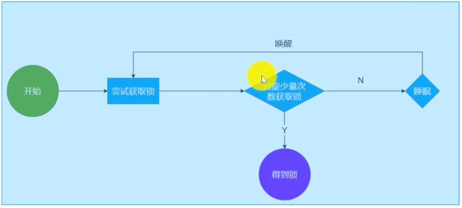

# 进程和线程

## 什么是进程
> 进程(Process)是程序的执行副本 - 一开始操作系统没有进程

Java在一台服务器上执行了多个服务, 其实就是启动了多个Java的进程

## 什么是线程
线程还被称为轻量级进程 - Linux的`LWP(Light Weight Process)`

- 并发(`Concurrent`) - 在一段时间内看起来是多个任务在同时执行, 但是从实际的时间上来说, 是`interleaved`(交错执行的)
- 并行(`parallel`) - 指任务真的在同时执行(`simultaneously`)
- 线程是一种并发的模型

## 进程和线程模型
- 进程是线程的容器。
- 资源分配问题：CPU会将计算资源分配给**线程**，而文件（管道文件，网络，消息队列），内存会被分配给进程

### 为什么会有线程？
### 主线程
用户进行创建进程的时候，就会跟随创建一个主线程，否则就没有计算资源分配了。

### 创建线程需要什么？
1. 需要提供一段程序
2. 入口指令内存地址

### 线程对内存的权限
> 资源分配给了进程，所以线程会共享进程的所有内存。

> 只不过Java限制了一部分的权限，使得我们在使用Java时无法操作进程中的所有内存。但是操作系统没有此限制
## 内核级线程和用户级线程
### 用户空间
### 内核空间
内核级线程由内核调度，用户级线程由应用自己来调度。

用户级线程的缺点：在Java 1.0年代，内核在创建进程的时候，会为进程启动一个主线程。此时操作系统只知道主线程的存在，而用户线程是由主线程创造的。这样的话，所有的用户创建的线程，只能共享主线程的时间片段。

在Java1.1后，Java在创建新的线程时，使用的是系统提供的线程创建的API，这样的话这些线程都会被内核知道，也会被内核调度到，并共享所有内核的时间片段。

## 线程的状态
### 基本的三个状态
1. 运行状态：执行
2. 就绪状态：排队
3. 休眠态/阻塞态

就绪态无法直接变成阻塞态。
阻塞态不能直接到就绪态

### Java的6个线程状态
1. NEW
2. RUNNABLE
3. BLOCKED
4. TERMINATE
5. WAITING
6. TIME_WAITING

### Thread.join()会把线程变为什么状态
WAITING

### Thread.sleep()会把线程变为什么状态
TIMEWAITING

### 网络请求会把线程变为什么状态
BLOCK

## 线程的切换(Context Switch)
1. 保存当前线程的状态（CPU寄存器的值）
2. 重新执行调度程序（操作系统），重新选择其他线程进行执行

举例：在线程读取磁盘数据的时候，IO请求的时间很长，这个时候线程就会休眠将时间片让出来

线程是执行单位，不拥有资源

线程A -> CPU中断 -> OS中断处理(保存CPU寄存器中的值) -> OS调度(选择新线程B) -> OS恢复寄存器中的值到B线程 -> 线程B开始执行
